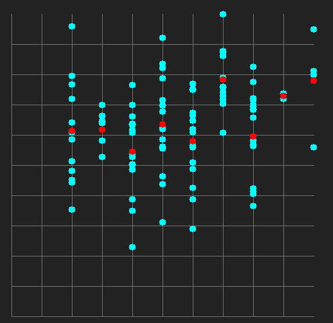

# Graphy

This library contains the necessary materials to display graphs and data points.

## Getting started

*Disclaimer: As of time of writing, this has only been tested using OSX*

All you should need to start working with graphy is to download the source code.

You must include "graphy.h" in your project - and obviously compile with the source files -

---

To create your graph, simply create a new instance of a `t_graph` struct and fill it with you graph's information.

```
typedef struct	s_graph
{
	int			width;
	int			height;

	int			div_width;
	int			div_height;

	int			origin_x;
	int			origin_y;

	int			x_min;
	int			x_max;

	int			y_min;
	int			y_max;

}				t_graph;
```

A template graph function is available, which initializes a 500 x 500 (pixels) graph.

```
t_graph	init_graph(int x_min, int x_max, int y_min, int y_max);
```

Once you have a graph, you will need to  use `points_create` and `points_adjust` in order to create points and adjust them to fit your graph.

You may use `out_circle` to display your points or your own function.

## Functions

These are the function for the Graphy API

---

### init_graph

`t_graph	init_graph(int x_min, int x_max, int y_min, int y_max)`

Initalizes a template 500 x 500 pixels graph.

**Returns:** An initialized t_graph struct

---
### points_create

`void			points_create(t_point *dest, int size, void *data, int width, t_point (*func)(void *));`

Fills an array of t_points according to the return value of `func`

**Returns:** Void

```
t_point *point_arr;
int		*some_data = {1,2,4,5,7,8}

point_arr = calloc(point_amount, sizeof(*point_arr));

points_create(point_arr, arr_len, some_data, sizeof(*some_data), data_to_point_func);
```

---
### points_adjust

`void			points_adjust(t_point *points, t_graph graph, int amount, t_coordinates (*func)(t_coordinates, t_graph));`

Adjusts an array of t_point to the given t_graph according to the return value of `func`

```
t_point *point_arr;
t_graph graph;
int		*some_data = {1,2,4,5,7,8}

graph = init_graph(0, 10, 0, 10);
point_arr = calloc(point_amount, sizeof(*point_arr));

points_create(point_arr, arr_len, some_data, sizeof(*some_data), data_to_point_func);
points_adjust(point_arr, graph, arr_len, adjust_func);
```


---
### coord_GraphToScreen

`t_coordinates	coord_GraphToScreen(t_coordinates coord, t_graph graph);`

Translates graph coordinates to screen coordinates(in pixels);
**Returns:** t_coordinate of the translated point

```
t_point *point_arr;
t_graph	graph;
int		arr_len;

for (int i = 0; i < arr_len, i++)
{
	if (coord_GraphToScreen(point_arr[i], graph).x == 0)
		printf("Point lies on the edge");
}
```

---

### coord_ScreenToGraph

`t_coordinates	coord_ScreenToGraph(t_coordinates coord, t_graph graph);`

Translates screen coordinates(in pixels) to graph coordinates;
**Returns:** t_coordinate of the translated point

```
t_point *point_arr;
t_graph	graph;
int		arr_len;

for (int i = 0; i < arr_len, i++)
{
	if (coord_ScreenToGraph(point_arr[i], graph).x == 0)
		printf("Point lies on the edge");
}
```

---
### in_point

`bool			in_point(int x, int y, t_point point);`

Finds whether a position lies within a point
**Returns:** true if position is within a point, otherwise false

```
int mouse_x;
int mouse_y;
int arr_len;
t_point *points;

for (int i = 0; i < arr_len; i++)
{
	if (in_point(mouse_x, mouse_y, points[i]))
		printf("Mouse is touching point %d\n", i);
}
```

---
### out_circle


void			out_circle(t_point circle, void (*f)(void *, int, int), void *meta_data);

---
### get_average

Gets the average of SIZE points from a t_point array

**Returns:** t_coordinate where x is the x average and y is the y average

`t_point			get_average(t_point *point_arr, int size);`

```
t_point *points;
t_point	avg;
int 	arr_len;

avg = get_average(points, arr_len);

printf("X average %d, Y average %d, Average color %d\n", avg.coord.x, avg.coord.y, avg.color);
```

---

Some examples:



